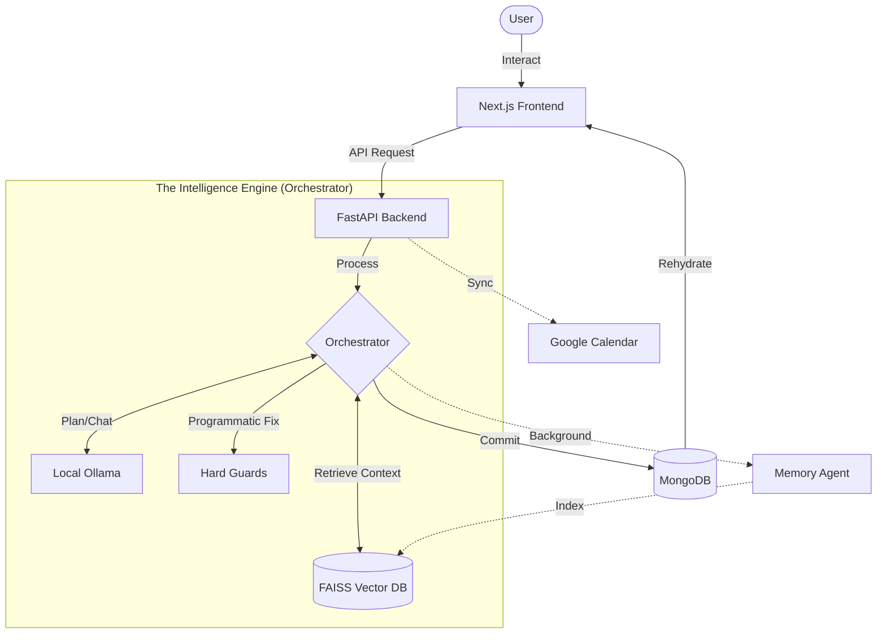

# LifeOS: Full System Data Flow & Orchestration Logic 🔄

This document provides a deep-dive into how data moves through the LifeOS ecosystem and the specific logic governing the AI orchestration pipeline.

---

## 🛰️ High-Level Topology

LifeOS utilizes a **Reactive Orchestration** model. The `AIOrchestrator` centralizes context, invokes specialized agents, and enforces programmatic "Hard Guards" before any data is committed.

---

## 🔬 Implementation Logic: The 3-Stage Pipeline

The core logic resides in `backend/ai_orchestrator.py`. Every request for a plan follows this strict lifecycle:

### Stage 1: ASSEMBLE (Context Inflation)
The orchestrator converts a simple user request into a "thick" payload that ensures the AI understands your life:
1.  **Identity Inflation**: Fetches the `UserProfile` (wake/sleep/work times).
2.  **Hierarchy Logic**: Using `PlanningService.get_hierarchy_context`, it finds relevant weekly goals or monthly milestones to inject into a daily plan request. This ensures a daily plan align with your bigger picture.
3.  **Performance Analytics**: It pulls the last **7 plans** of that type to calculate current success/failure rates.
4.  **Failure Patterns**: It queries the `Pattern` model to find specific time-slots where you historically fail (e.g., "Always misses Gym at 6am") so the AI can suggest better times.
5.  **Routine Skeletons**: If a `RoutineTemplate` exists for the current day, it's injected as the "skeleton" for the new plan.

### Stage 2: GENERATE (Strategy-Driven AI)
Instead of a generic prompt, LifeOS uses the **Strategy Pattern**:
1.  **PlanningFactory**: Selects the logic based on the `PlanType` (Daily, Weekly, Monthly, Finance, or Custom).
2.  **RAG Injection**: The `rag_manager` retrieves top-k (k=3) "Rules of Life" (e.g., "Don't work after 10 PM") and embeds them into the system prompt.
3.  **Deterministic Tuning**: LLM parameters are set to `Temperature: 0.1` and `max_tokens: 768` to ensure speed and logical consistency.
4.  **Fallback Chain**: If the AI fails to produce a valid JSON plan (schema mismatch or timeout), the orchestrator triggers `_build_fallback_plan`—a deterministic schedule based purely on your profile constraints.

### Stage 3: PERSIST (Transactional Sync)
Before writing to the database, a final validation layer runs:
1.  **Self-Healing Guard**: Calls `fix_overlaps()` to programmatically resolve any time-slot conflicts the AI might have missed.
2.  **Model Mapping**: The raw JSON is split into a parent `Plan` document (for summary and metadata) and multiple `Task` documents.
3.  **Atomic Persistence**: Uses `insert_many` for tasks to ensure the database write is as close to a single transaction as possible.
4.  **Metadata Capture**: Any extra AI suggestions (outcomes, KPI targets, mood checks) are saved into a metadata blob for the UI to render as progressive enhancements.

---

## 💾 Storage & Persistence Mapping

| Entity | Primary Store | Retrieval Logic |
| :--- | :--- | :--- |
| **Structured State** | MongoDB | Beanie ODM (Direct ID/User queries) |
| **Semantic Knowledge**| FAISS | RAG (Vector Similarity Search) |
| **Transient Logic** | Redis | Key-Value Cache (Short-term context) |

---
*Optimized Living through Orchestrated AI.*
